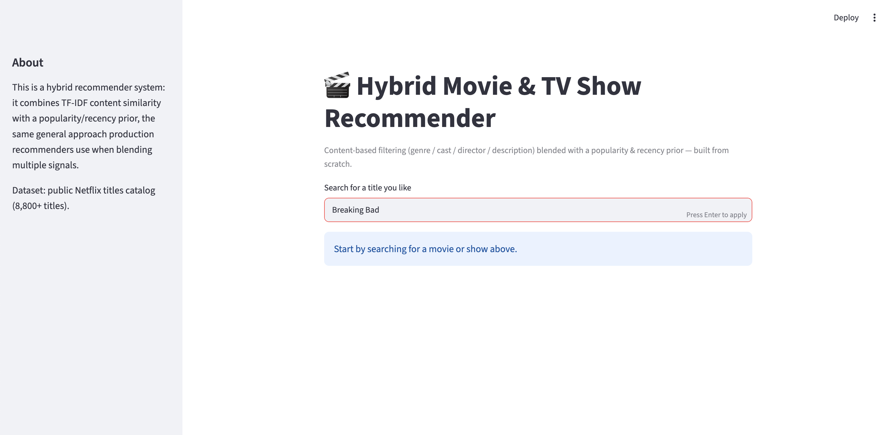
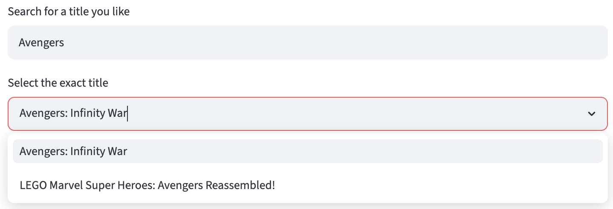
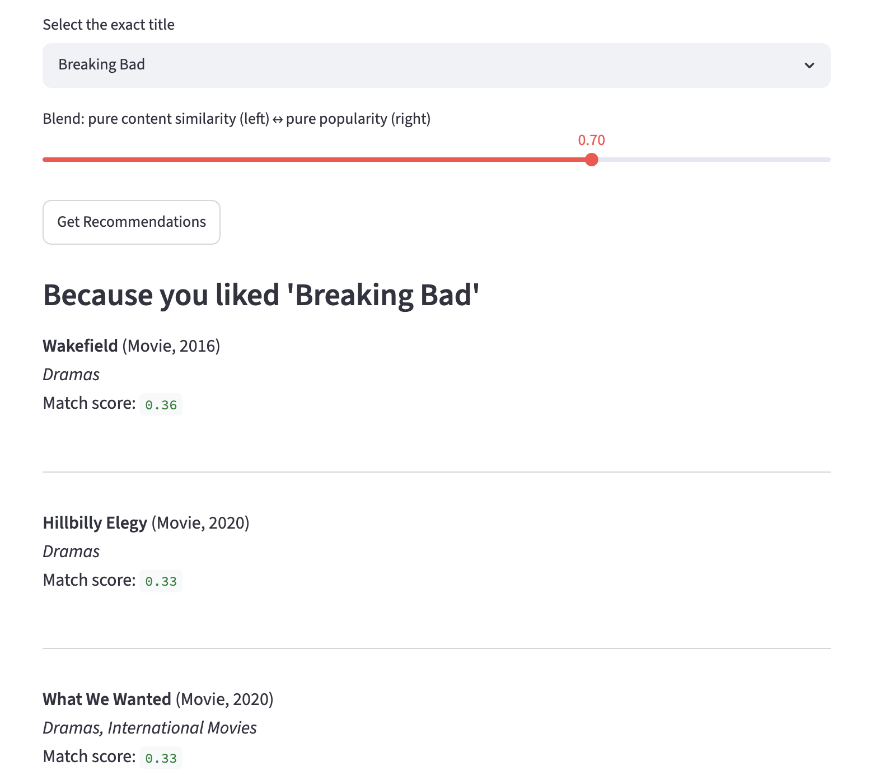

# 🎬 Hybrid Netflix-Style Recommendation System

A movie & TV show recommender that blends **content-based filtering** with a
**popularity/recency prior**, wrapped in an interactive Streamlit app.

## How it works

1. **Content similarity** — each title's genres, top cast, director, and
   description are combined into a single text "soup," vectorized with
   TF-IDF, and compared using cosine similarity. This finds titles that are
   *similar in substance* to the one you picked.
2. **Popularity / recency prior** — since the public dataset has no
   per-user ratings, recency and genre frequency are used as a proxy for
   "broadly popular," the same role real collaborative-filtering signals
   play in production systems.
3. **Hybrid blend** — a tunable `alpha` weight combines both signals into
   one final ranking, adjustable live in the app.

## Tech stack

- Python, pandas, scikit-learn (TF-IDF + cosine similarity)
- Streamlit for the UI

## Run it locally

```bash
pip install -r requirements.txt
streamlit run app.py
```

Then open the local URL Streamlit prints (usually `http://localhost:8501`).

## App screenshots

### Home page



### Title selection



### Recommendations view



## Dataset

Public Netflix titles catalog (~8,800 movies/TV shows with genre, cast,
director, and description metadata), sourced from the TidyTuesday project.

## Possible extensions

- Swap the popularity prior for real collaborative filtering (SVD via the
  `surprise` library) once a ratings dataset is added.
- Add posters via a movie API (TMDB) for a richer UI.
- Deploy on Streamlit Community Cloud for a live demo link.

## License

MIT